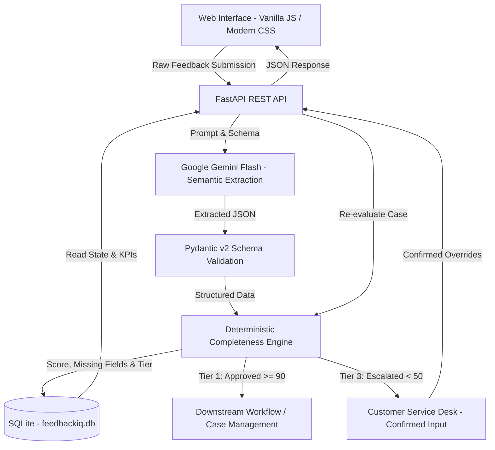

# FeedbackIQ — AI-Powered Feedback Quality & Follow-up Layer

FeedbackIQ, sağlık ve kurumsal hizmet süreçlerinde serbest metin olarak gelen müşteri ve hasta geri bildirimlerinin operasyonel açıdan yeterli olup olmadığını değerlendiren, eksik bilgileri belirleyen ve tamamlanması gereken kayıtları uygun takip akışına yönlendiren AI destekli bir veri kalitesi katmanıdır.

Bu proje, kurumların halihazırda kullandığı CRM, vaka yönetimi (case management) veya hasta hakları platformlarının yerini almayı hedeflemez. Aksine, ham geri bildirimlerin bu sistemlere aktarılmadan önce operasyonel veri kalitesini denetleyen, veri açığını önleyen ve eksik bildirimlerin araştırılabilir hale gelmesini sağlayan tamamlayıcı bir Proof-of-Concept (POC) katmanıdır.

> **Önemli Not:** Bu proje proof-of-concept amaçlıdır. Kullanılan tüm hasta/müşteri kayıtları sentetiktir. Sistem klinik karar veya tıbbi tavsiye üretmez.

---

## 1. Business Problem

Hizmet sektöründe ve özellikle sağlık operasyonlarında, kullanıcı veya hasta tarafından iletilen bir geri bildirim kişinin kendi bakış açısıyla tamamen net olabilir; ancak operasyonel ekipler açısından araştırılabilir ve aksiyon alınabilir nitelikte olmayabilir.

### Örnek Geri Bildirim:

> *"Dün hastanenize geldim, çok uzun süre bekledim ve kimse gecikmenin nedenini açıklamadı."*

Bu bildirimde bir mağduriyet açıkça ifade edilmektedir; ancak operasyonel açıdan şu kritik değişkenler eksiktir:

- **Hangi hastane / şube?** (Birden fazla yerleşkesi bulunan bir kurumda şikayetin hangi lokasyona ait olduğu belirsizdir.)
- **Hangi departman / poliklinik?** (Göz, Kardiyoloji, Acil Servis veya Kayıt Bankosu?)
- **Yaklaşık saat?** (Günün hangi saatinde gerçekleştiği bilinmediği için randevu çizelgeleri, bekleme sıraları veya vardiya logları taranamaz.)
- **Hizmet türü?** (Poliklinik muayenesi, radyoloji çekimi, laboratuvar tahlili veya vezne ödeme işlemi?)
- **İlgili personel veya işlem bilgisi?** (Gerektiğinde incelenebilecek hekim, sekreter veya görevli unvanı/adı.)

### Doğurduğu Operasyonel Problemler:

- **Yanlış Yönlendirme:** Lokasyon ve birim bilgisi eksik olan kayıtların ilgisiz departman yöneticilerine atanması.
- **Manuel Kontrol İhtiyacı:** Temsilcilerin her belirsiz geri bildirim için ilk incelemeyi manuel yapmak zorunda kalması.
- **Departmanlar Arası Gereksiz Aktarım:** Birimlerin sorumluluk alanı dışındaki vakaları birbirine yönlendirmesiyle oluşan zaman kaybı.
- **Çözüm Süresinin Uzaması:** Eksik verinin geriye dönük toplanması aşamasında şikayetin günlerce açık kalması.
- **Düşük Kaliteli Vaka Kaydı:** Raporlama ve kök neden analizlerinde veri açığı (data deficit) nedeniyle kullanılamayan kayıtların birikmesi.

---

## 2. Solution Overview

FeedbackIQ, yapılandırılmamış metinleri doğrudan iş süreçlerine sokmak yerine deterministik doğrulamadan geçirir:

```
Unstructured Feedback (Web, QR, E-posta, Çağrı Merkezi)
                     │
                     ▼
       Gemini Structured Extraction
 (Metindeki ham değişkenleri semantik olarak ayrıştırır)
                     │
                     ▼
            Pydantic Validation
    (Veri tiplerini ve şema bütünlüğünü doğrular)
                     │
                     ▼
      Deterministic Completeness Engine
(Kategori bazlı kurallarla eksik alanları ve cezaları hesaplar)
                     │
                     ▼
  Quality Score + Missing Fields + Routing Decision
                     │
         ┌───────────┴───────────┐
         ▼                       ▼
Ready for Workflow      Follow-up Required
 (Aşama 1: Onaylandı)   (Kademe 2: AI Voice Concept /
                         Kademe 3: Customer Service Review)
```

Projede geniş dil modelleri (LLM) ile kural motorlarının sınırları net biçimde ayrılmıştır. Gemini metindeki semantik anlamı yorumlayarak ham veriyi şemaya döker; yönlendirme, puanlama ve onay kararları ise deterministik iş kurallarıyla yürütülür:

> *"Gemini interprets unstructured feedback, while operational decisions remain deterministic and explainable."*

---

## 3. Core Design Principles

- **LLM is not the decision engine:** Yapay zeka iş kararı vermez; yalnızca yapılandırılmamış serbest metinden değişkenleri şemaya ayrıştırır.
- **Missing information should remain missing:** Metinde bulunmayan bir parametre yapay zeka tarafından tahmin edilmez veya üretilmez; eksikse eksik olarak etiketlenir.
- **Deterministic business rules control scoring and routing:** Kalite skoru, ceza ağırlıkları ve 3 kademeli yönlendirme eşikleri şeffaf, denetlenebilir Python kurallarıyla hesaplanır.
- **Human-in-the-loop for critical missing information:** Kritik operasyonel parametrelerin eksik olduğu durumlarda karar süreci insan temsilciye (Customer Service Review) devredilir.
- **Confirmed manual input takes precedence over AI-extracted values:** Temsilcinin veya hastanın teyit ettiği bilgiler, yapay zekanın ilk çıkarımından üstündür ve sistemde öncelik taşır.
- **Re-evaluation closes the data quality loop:** Teyit edilen eksik bilgiler girildiği anda vaka yeniden puanlanır ve veri kalitesi döngüsü doğrulanmış olarak kapanır.

---

## 4. Operational Workflow

Geri bildirimler hesaplanan veri kalitesi skoruna ve eksik parametrelerin ağırlığına göre 3 kademeli operasyonel akışa tabi tutulur:

```
Kalite Skoru
 100 ────┬──── Tier 1: Workflow Ready (Aşama 1: Onaylandı)
         │     * Skor >= 90
         │     * Operasyonel bağlam yeterli, doğrudan downstream iş akışına iletilir.
  90 ────┼────────────────────────────────────────────────────────────
         │     Tier 2: AI Voice Follow-up Concept (Kademe 2: AI Sesli Arama)
         │     * Skor 50–89 (Orta düzey eksiklik, örn: randevu saati belirsiz)
         │     * Gelecek dönem entegrasyonlarını modelleyen simülasyon katmanıdır.
  50 ────┼────────────────────────────────────────────────────────────
         │     Tier 3: Customer Service Review (Kademe 3: Temsilci İncelemesi)
         │     * Skor < 50 veya kritik alanlar (şube, poliklinik) eksik
         │     * İnsan temsilci masasına yönlendirilir; hedeflenmiş takip soruları üretilir.
   0 ────┴────────────────────────────────────────────────────────────
```

### Tier 1 — Workflow Ready
- Kalite skoru 90 ve üzerindedir.
- Hastane, birim ve olay tanımı gibi temel operasyonel gereksinimler karşılanmıştır.
- Kayıt doğrudan ilgili birim yöneticisine veya operasyonel inceleme sürecine aktarılabilir.

### Tier 2 — AI Voice Follow-up Concept
- Skor 50 ile 89 arasındadır; temel lokasyon bellidir ancak takip için gereken ikincil alanlar (örneğin randevu saati veya servis türü) eksiktir.
- **Önemli Not:** Bu modül bir gelecek durum (future-state) konsept simülasyonudur; gerçek bir telefon araması başlatmaz. Sistem, ileride sesli yapay zeka entegrasyonu sağlandığında küçük veri eksikliklerinin insan müdahalesine gerek kalmadan nasıl otomatik tamamlanabileceğini modellemektedir.

### Tier 3 — Customer Service Review
- Skor 50'nin altındadır veya hastane şubesi gibi yönlendirmeyi imkansız kılan kritik parametreler eksiktir.
- Vaka, müşteri hizmetleri temsilci masasına iletilir.
- Sistem temsilciye eksik alanlara özel hedeflenmiş soru önerileri sunar.
- Temsilci hastayla görüşerek teyit ettiği verileri form üzerinden kaydeder ve vaka anında yeniden değerlendirilir (re-evaluation).

---

## 5. Deterministic Completeness Scoring

Puanlama motoru sezgisel veya olasılıksal tahminler yerine şeffaf ve deterministik bir ceza formülü kullanır:

$$\text{Quality Score} = 100 - (\text{Major Missing Field} \times 30) - (\text{Minor Missing Field} \times 10)$$

### Eşik Değerler (Thresholds):

| Skor Aralığı | Kademe | Operasyonel Karar |
| :--- | :--- | :--- |
| **>= 90** | **Tier 1 — Workflow Ready** | İnceleme için yeterli veri mevcut; ilgili birime sevk edilir. |
| **50 – 89** | **Tier 2 — AI Voice Follow-up Concept** | Küçük eksiklikler mevcut; konsept sesli takip kuyruğuna alınır. |
| **< 50** veya çoklu kritik eksik | **Tier 3 — Customer Service Review** | Yönlendirme yapılamaz; insan temsilci incelemesine eskalasyon. |

Kategori bazlı zorunlu alan kuralları (`WAITING_TIME`, `STAFF_BEHAVIOR`, `BILLING_PAYMENT`, `MEDICAL_CARE`, `CLEANLINESS_FACILITY`, `APPRECIATION`) ve ceza ağırlıkları `feedbackiq/config/completeness_rules.py` dosyasında açıkça tanımlanmıştır.

Puanlama motoru dış bağımlılıklardan arındırılmış saf Python fonksiyonları ile çalışır; aynı girdi her zaman birebir aynı kalite skorunu ve yönlendirme kararını üretir.

---

## 6. Key Features

- **AI-Based Structured Information Extraction:** Serbest metinli ham bildirimlerden hastane, departman, saat, tarih, personel ve vaka özetinin yapılandırılmış çıkarımı.
- **Category-Aware Completeness Validation:** Geri bildirim kategorisine göre (bekleme süresi, fatura, personel davranışı vb.) değişen dinamik operasyonel gereksinim kontrolü.
- **Missing-Field Detection:** Operasyonel inceleme için zorunlu olan ve metinde bulunmayan parametrelerin net tespiti.
- **Deterministic Quality Scoring:** 100 puan üzerinden şeffaf, izlenebilir ve kural tabanlı ceza puanı hesaplaması.
- **Targeted Follow-up Question Generation:** Yalnızca eksik kalan parametreler için temsilciye veya iletişim kanalına yönelik özel soru önerisi üretimi.
- **Customer Service Follow-up Queue:** Kritik veri açığı bulunan vakaların temsilci masasında toplanması ve önceliklendirilmesi.
- **Re-evaluation After Confirmed Information:** Teyit edilen manuel girdilerle vakanın anında yeniden puanlanarak operasyonel onaya kavuşturulması.
- **Channel-Based Feedback Quality Analytics:** Web sitesi, QR kod, e-posta ve çağrı merkezi gibi kanalların ortalama veri kalitesi analitiği.
- **Synthetic Demo Case Dataset:** Farklı eksiklik ve kalite seviyelerini temsil eden hazır sentetik test senaryoları.
- **Test Coverage for Scoring and End-to-End Workflow:** Deterministik kuralları, öncelik mekanizmalarını ve uçtan uca akışı doğrulayan test paketi.

---

## 7. Screenshots

### Dashboard

*Görsel: `görseller/01_dashboard_kpis.png` — Kurum genelindeki geri bildirim kalitesi, 3 kademeli dağılım, ortalama kalite skoru ve en sık eksik kalan operasyonel alanların izlendiği genel bakış ekranı.*

### Intake & Analysis

*Görsel: `görseller/02_feedback_intake_analysis.png` — Serbest metin girişi, Gemini semantik çıkarımı, tespit edilen operasyonel parametreler ve deterministik kalite puanlama sonucu.*

### AI Voice Follow-up Concept

*Görsel: `görseller/03_ai_voice_call_modal.png` — Küçük veri eksikliklerinin gelecekte otonom sesli aramayla nasıl tamamlanabileceğini gösteren konsept arayüz simülasyonu (gerçek bir telefon araması başlatmaz).*

### Customer Service Case Desk

*Görsel: `görseller/04_case_desk_reevaluation.png` — Temsilcinin hasta ile görüşerek teyit ettiği verileri girdiği, eksik alanları kapattığı ve vakayı anında yeniden puanlayarak onayladığı çalışma alanı.*

### Operational Analytics

*Görsel: `görseller/05_operational_analytics.png` — Kaynak kanallara göre veri kalitesi karşılaştırması, eksik alan sıklıkları ve vaka dağılım analitiği.*

---

## 8. Architecture



Müşteri hizmetleri masasından girilen teyitli manuel bilgiler (`Confirmed Overrides`) tekrar deterministik kurallar motoruna aktarılır; bu sayede vaka skoru doğrulanmış verilerle güncellenerek döngü tamamlanır.

---

## 9. Technology Stack

| Katman | Teknoloji | Açıklama |
| :--- | :--- | :--- |
| **Backend** | Python, FastAPI, Uvicorn | Asenkron REST API servisi ve iş kuralları orkestrasyonu |
| **AI** | Google GenAI SDK / Gemini Flash | Yapılandırılmamış metinden semantik bilgi çıkarımı |
| **Validation** | Pydantic v2 | Katı tip denetimi ve çıkarım şeması doğrulaması |
| **Rules Engine** | Deterministik Python Kuralları | Matematiksel ceza puanı ve 3 kademeli yönlendirme motoru |
| **Database** | SQLite | Hafif, kurulum gerektirmeyen ilişkisel veri saklama katmanı |
| **Frontend** | Vanilla JavaScript, HTML, CSS | Harici bağımlılıksız modern tek sayfa uygulama (SPA) |
| **Testing** | Pytest | Birim ve entegrasyon testlerinin otomasyonu |

---

## 10. Repository Structure

```
FeedbackIQ/
├── app.py                           # Giriş noktası ve sunucu çalıştırma betiği
├── feedbackiq/
│   ├── config/
│   │   ├── completeness_rules.py    # Kategori kuralları, ceza puanları ve eşik değerler
│   │   └── question_templates.py    # Eksik parametreler için soru şablonları
│   ├── database/
│   │   ├── db.py                    # SQLite bağlantısı ve tablo şemaları
│   │   ├── repository.py            # Veritabanı sorguları ve CRUD operasyonları
│   │   └── seed.py                  # Sentetik vaka veri seti tohumlayıcısı
│   ├── models/
│   │   └── schemas.py               # Pydantic v2 veri modelleri ve enum tanımları
│   ├── pages/                       # Sayfa bileşenleri ve rota tanımlayıcıları
│   ├── services/
│   │   ├── ai_call_service.py       # Gelecek durum sesli arama simülasyon servisi
│   │   ├── completeness_service.py  # Deterministik puanlama ve triage motoru
│   │   ├── followup_service.py      # Teyitli veri girişi ve yeniden puanlama servisi
│   │   └── gemini_service.py        # Gemini yapılandırılmış semantik çıkarım servisi
│   ├── tests/
│   │   ├── test_completeness.py     # Puanlama, ceza ve yönlendirme birim testleri
│   │   └── test_feedback_extraction.py # Uçtan uca bilgi çıkarımı ve simülasyon testleri
│   ├── utils/                       # Yardımcı fonksiyonlar ve formatlayıcılar
│   ├── web/
│   │   ├── app.js                   # İstemci tarafı uygulama mantığı ve API çağrıları
│   │   ├── index.html               # Tek sayfa arayüz yapısı
│   │   └── styles.css               # Arayüz tasarım stilleri ve bileşenleri
│   └── server.py                    # FastAPI uygulama örneği ve API endpoint'leri
├── görseller/                       # Dokümantasyon ekran görüntüleri
├── .env.example                     # Çevre değişkenleri şablonu
├── requirements.txt                 # Python kütüphane bağımlılıkları
├── LICENSE                          # MIT Açık Kaynak Lisansı
└── README.md                        # Proje dokümantasyonu
```

---

## 11. Testing

Projedeki iş kuralları, ceza puanları, yönlendirme eşikleri ve uçtan uca akış Pytest ile test edilmektedir.

### Testleri Çalıştırma:

```bash
PYTHONPATH=. pytest feedbackiq/tests/ -v
```

### Kapsanan Senaryolar:

- **Complete Case Validation (`test_sufficient_data_reaches_tier_1_approved`):** Gerekli tüm operasyonel parametreleri içeren vakaların doğrudan 90+ puan alarak Aşama 1 onayı alması.
- **Minor Missing Data Routing (`test_minor_gap_reaches_tier_2_ai_call`):** Randevu saati gibi ikincil alanların eksik olması durumunda vakanın Kademe 2'ye yönlendirilmesi.
- **Critical Missing Data Escalation (`test_major_gap_reaches_tier_3_csr_escalation`):** Hastane şubesi veya ilgili birimin eksik olduğu durumlarda ceza puanıyla vakanın Kademe 3 Müşteri Hizmetleri masasına eskalasyonu.
- **Manual Override Precedence (`test_manually_confirmed_values_take_precedence`):** Temsilcinin telefon görüşmesi sonrası sisteme girdiği teyitli değerlerin, modelin ilk tahmininin üzerine yazılması.
- **Targeted Missing-Field Questions (`test_question_generator_asks_only_about_missing_fields`):** Soru motorunun yalnızca eksik kalan alanlar için hedeflenmiş soru üretmesi; mevcut alanları tekrar sormaması.
- **Score Increase After Follow-up (`test_adding_followup_information_increases_score_and_resolves`):** Eksik alanların teyit edilmesiyle vaka puanının yükselmesi ve onay durumuna geçmesi.
- **End-to-End Workflow (`test_core_end_to_end_scenario`):** Ham metin girişinden semantik çıkarıma, veritabanı kaydına, temsilci müdahalesine ve canlı yeniden değerlendirmeye kadar tüm akışın doğrulanması.
- **Voice Call Simulation (`test_ai_voice_call_simulation`):** Konsept sesli arama simülatörünün eksik veriyi tamamlayarak vakayı bir üst aşamaya taşımasının testi.

---

## 12. Data Privacy & Scope

- **Yalnızca Sentetik Veri:** Bu projede kullanılan veya toplanan tüm vaka, hasta, hekim ve hastane bilgileri sentetiktir; gerçek kişi veya kurumlara ait veri içermez.
- **Gerçek Hasta Kaydı İçermez:** Sistem herhangi bir elektronik sağlık kaydı (EHR/EMR) veya kişisel sağlık verisi (PHI) barındırmaz.
- **Tıbbi Tavsiye ve Klinik Karar Üretmez:** FeedbackIQ klinik karar destek sistemi (CDSS) değildir; teşhis, tedavi veya klinik tavsiye vermez. Yalnızca idari ve operasyonel geri bildirimlerin veri eksikliklerini değerlendirir.
- **Üretim Ortamı İddiası Bulunmamaktadır:** Bu depo bir konsept kanıtlama (POC) çalışmasıdır. Gerçek bir sağlık kuruluşunda canlı kullanıma alınması; kurumsal veri koruma politikaları (KVKK, HIPAA, GDPR), erişim yetkilendirme altyapıları, veri anonimleştirme protokolleri ve denetlenmiş kurumsal bulut güvenliği gerektirir.

---

## 13. Project Positioning

FeedbackIQ'ın temel odak noktası geri bildirimleri basitçe duygu analiziyle sınıflandırmak veya kategorize etmek değildir. Projenin asıl çözdüğü problem; **gelen geri bildirimin operasyonel olarak araştırılabilir, doğru birime yönlendirilebilir ve aksiyon alınabilir veri kalitesine sahip olup olmadığını denetlemektir.**

Bu doğrultuda FeedbackIQ, kurumların halihazırda yatırım yaptığı CRM, vaka yönetimi veya biletleme sistemlerini tekrar etmez ya da onların yerine geçmeyi amaçlamaz.

Sistem, ham geri bildirimlerin kurumsal iş akışlarına girmeden önce veri açığını önleyen bir:

**"AI-powered feedback data quality & follow-up layer"**

olarak konumlandırılır.

---

## 14. License

Bu proje [MIT Lisansı](LICENSE) kapsamında sunulmaktadır.
