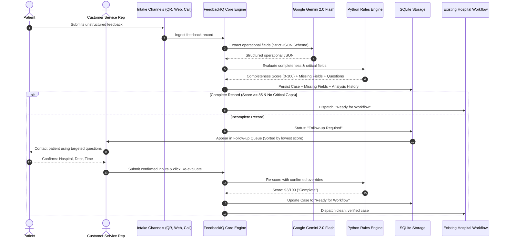

# FeedbackIQ — AI-Powered Patient Feedback Quality & Follow-up System

[](https://python.org)
[](https://streamlit.io)
[](https://ai.google.dev/)
[](https://pydantic.dev)
[](LICENSE)

An enterprise proof-of-concept AI quality assurance layer designed to complement hospital patient experience and case management platforms.

---

## 1. Executive Summary & Business Problem

### The Operational Challenge
In modern healthcare organizations, patient feedback arrives continuously across diverse channels: mobile QR codes, web complaint forms, call centers, and emails. Patients frequently express genuine distress or dissatisfaction in terse or unstructured messages such as:

> *"I waited for a very long time yesterday and nobody explained the delay."*

While this feedback captures acute dissatisfaction, it is **operationally incomplete**. Hospital administrators and department managers do not know:
- **Which hospital branch** was visited (e.g. Ataköy vs Camlıca vs Kadıköy).
- **Which clinical department** or unit is responsible (e.g. Cardiology, Emergency, Radiology).
- **What time of day** the event occurred (to audit queue management logs and shifts).
- **Which specific examination** was scheduled (outpatient consult, ultrasound, blood test).

When incomplete feedback records enter standard ticketing systems (such as Microsoft Dynamics, ServiceNow, or HIS case queues), employees waste valuable hours manually investigating, routing tickets back and forth between units, or contacting patients without knowing what questions to ask.

### The FeedbackIQ Solution
**FeedbackIQ acts as an intelligent data quality firewall positioned ahead of the hospital's operational case management workflow.** 

Before a feedback ticket is dispatched to hospital department heads, FeedbackIQ:
1. Silently extracts structured operational variables using Google Gemini with strict schema enforcement.
2. Evaluates investigative completeness using a deterministic Python rules engine (0–100 score).
3. Diverts incomplete cases into a dedicated **Customer Service Follow-up Queue**.
4. Automatically equips customer service representatives (CSRs) with targeted, missing-field questions.
5. Enables CSRs to log outreach, enter confirmed details, and re-evaluate the case.
6. Dispatches only fully verified cases to downstream department workflows.

---

## 2. Why This is NOT a Chatbot

FeedbackIQ intentionally avoids conversational chatbot UI patterns:

| Conversational Chatbots (Anti-pattern for this use case) | FeedbackIQ Intelligent Quality Layer |
| :--- | :--- |
| Puts an AI bot in front of upset patients demanding immediate answers. | Allows patients to submit feedback normally without conversational friction. |
| Risks AI hallucinations, unsolicited medical advice, or improper commitments. | Gemini acts strictly as a silent backend extraction engine (low temperature, strict JSON). |
| Lets LLMs decide business logic, priorities, and scoring. | **Python rules engine** controls scoring, thresholds, critical flags, and status. |
| Creates noisy dialogue threads that are hard to audit. | Structured, auditable database records with full audit trail in SQLite. |

---

## 3. System Architecture & Workflow

### Separation of Concerns
```
Unstructured Feedback Text
           │
           ▼
Google Gemini API (Official google-genai SDK)
           │ (Strict JSON Output, Temperature=0.1)
           ▼
Pydantic Schema Validation (ExtractedFeedbackData)
           │
           ▼
Deterministic Python Rules Engine (config/completeness_rules.py)
           │
           ▼
Completeness Score (0-100) & Critical Missing Check
           │
           ├───────────────────────────────┐
           ▼                               ▼
    [Complete >= 85]              [Incomplete < 85 or Critical Gap]
           │                               │
           ▼                               ▼
Ready for Normal Case Workflow    Customer Service Follow-up Queue
(HIS / CRM / Department Head)             │
                                           ▼
                                   CSR Contacts Patient
                                   (Using Targeted Suggested Questions)
                                           │
                                           ▼
                                   Enriched Re-evaluation
                                   (Confirmed Human Values Take Precedence)
                                           │
                                           ▼
                                   Ready for Normal Case Workflow
```

### Sequence Flow


---

## 4. Key Features

- **Controlled Controlled Issue Types:** Waiting Time, Staff Behavior, Billing / Payment, Appointment, Registration, Facility / Cleanliness, Medical Service Process, Communication, Technical Issue, Food / Catering, Parking / Transportation, Appreciation, General Suggestion.
- **Configurable Deterministic Rules Engine:** Configurable field weights and critical missing field constraints per issue type (`config/completeness_rules.py`).
- **Dynamic Follow-up Question Generation:** Deterministic question library that asks **only** about missing fields—never asking for details already known.
- **Prioritized CSR Follow-up Queue:** Real-time queue showing open follow-ups sorted by lowest completeness score first.
- **Context-Enriched Re-evaluation:** Enriches context with original text and CSR inputs; confirmed manual entries strictly take precedence over AI inferences.
- **Operational Channel Quality Analytics:** Audits data quality across intake sources (e.g. Website vs. QR Code vs. Call Center).
- **Dual Mode Reliability:** Seamlessly toggles between live Google Gemini API and a deterministic zero-quota Demo Mode fallback.

---

## 5. Technology Stack

- **Language:** Python 3.9+
- **Frontend / Application Framework:** Streamlit (clean enterprise SaaS theme)
- **AI Engine:** Google Gemini API (gemini-2.0-flash / gemini-1.5-flash via official `google-genai` SDK)
- **Data Validation:** Pydantic v2
- **Database:** SQLite3 (WAL mode, foreign keys, and indexes)
- **Data Manipulation & Charts:** Pandas, Plotly Express
- **Environment Management:** python-dotenv
- **Testing:** Pytest

---

## 6. Installation & Quickstart

### Prerequisites
- Python 3.9, 3.10, 3.11, or 3.12
- (Optional) A free Google Gemini API Key from [Google AI Studio](https://aistudio.google.com/app/apikey)

### Step 1: Clone & Setup Environment
```bash
git clone https://github.com/egeziyayildiz/feedbackiq.git
cd chatbot

# Create and activate virtual environment
python3 -m venv venv
source venv/bin/activate

# Install dependencies
pip install -r requirements.txt
```

### Step 2: Configure Environment Variables
Copy `.env.example` to `.env`:
```bash
cp .env.example .env
```
Edit `.env` (optional if using Demo Mode):
```ini
# Add your Gemini API key from https://aistudio.google.com/app/apikey
GEMINI_API_KEY=your_gemini_api_key_here

# Model name (default: gemini-2.0-flash)
GEMINI_MODEL=gemini-2.0-flash

# Keep DEMO_MODE=true to allow graceful offline/quota-safe testing
DEMO_MODE=true
```

### Step 3: Run the Application
```bash
streamlit run app.py
```
Open your browser at `http://localhost:8501`. The database will automatically initialize and seed with 11 realistic healthcare demo records.

---

## 7. Running Unit & Integration Tests

The project includes unit and integration tests covering the rules engine, priority calculation, CSR follow-up enrichment, and the full end-to-end acceptance scenario:

```bash
PYTHONPATH=. pytest feedbackiq/tests/ -v
```

Expected output:
```
============================== 8 passed in 0.17s ===============================
```

---

## 8. End-to-End Demonstration Scenario

To demonstrate the full business value of FeedbackIQ, execute this step-by-step walkthrough:

1. **Navigate to "New Feedback":**
   Paste the following incomplete patient feedback:
   > *"I waited for a very long time yesterday and nobody explained the delay."*
2. **Click "Analyze Feedback":**
   - Gemini accurately detects: `Complaint`, `Waiting Time`, `Negative Sentiment`.
   - The rules engine detects that `Hospital`, `Department / Service`, and `Approximate Time` are missing.
   - The completeness score evaluates to **~35 / 100** (`Follow-up Required`).
   - The system displays the explanation of why follow-up is needed and generates targeted questions:
     - *"Which hospital or facility did you visit?"*
     - *"Which department or unit did you receive service from?"*
     - *"Approximately what time did the incident occur?"*
3. **Open the "Customer Service Follow-up Queue":**
   - The case appears at the top of the queue with **High Priority** and lowest completeness score.
4. **Click "Open Case":**
   - Review original text, known fields, and pending questions.
   - Under the CSR Outreach section, update Contact Status to `Information Collected`.
   - Enter the collected information:
     - **Hospital:** `Example Hospital Central`
     - **Department:** `Cardiology`
     - **Approximate Time:** `14:00`
5. **Click "Re-evaluate Case Completeness":**
   - The score jumps from **35** to **95 / 100**.
   - Status updates to **"Ready for Workflow"**.
   - A celebration banner confirms: *"Feedback successfully completed and ready for the normal case management workflow."*

---

## 9. Data Privacy & Compliance Notice

- **Proof-of-Concept Scoping:** This application is a portfolio proof-of-concept. All seeded records use synthetic, non-identifiable patient scenarios.
- **Non-Clinical Boundaries:** FeedbackIQ strictly evaluates administrative, logistical, and operational variables (waiting time, billing discrepancies, cleanliness, staff courtesy). **It does not perform clinical triage, make medical diagnoses, or offer treatment advice.**
- **No PHI Retention:** No government identification numbers, Turkish National IDs (TCKN), credit card numbers, or medical records are stored.

---

## 10. Future Roadmap

- [ ] **Microsoft Power Platform Connectors:** Custom connector for Microsoft Power Automate & Dataverse to automatically push complete tickets into Dynamics 365 Customer Service.
- [ ] **Hospital Information System (HIS) Integration:** Direct HL7 / FHIR connectors for Epic Systems, Cerner, and localized Turkish hospital HIS platforms.
- [ ] **Automated Dynamic Form Optimization:** Automatically reconfigure hospital web/QR survey forms if a particular channel repeatedly yields incomplete records.
- [ ] **Multilingual NLP Extraction:** Native multi-language support (Turkish, English, Arabic, German) for medical tourism hospitals.

---

## License

Distributed under the MIT License. See `LICENSE` for more information.
