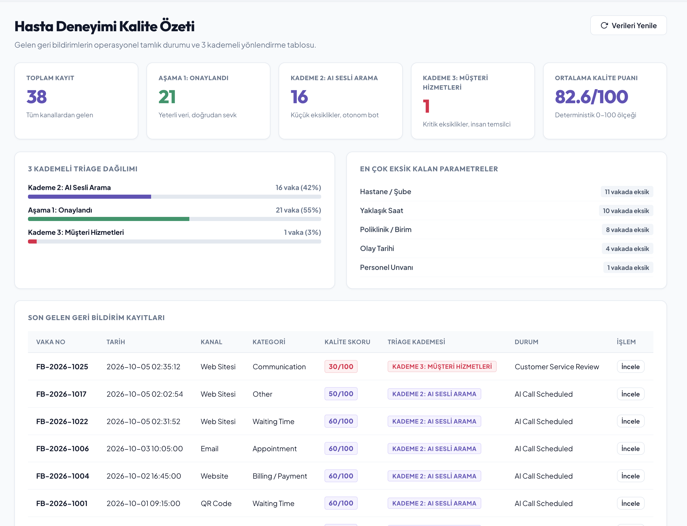
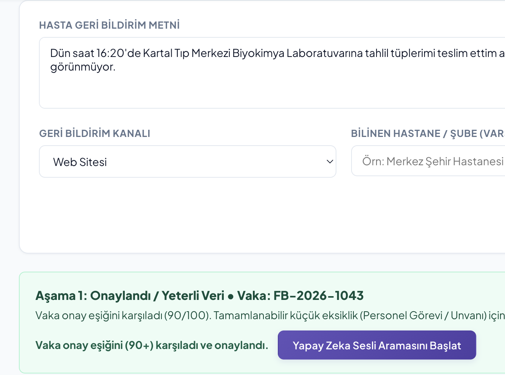
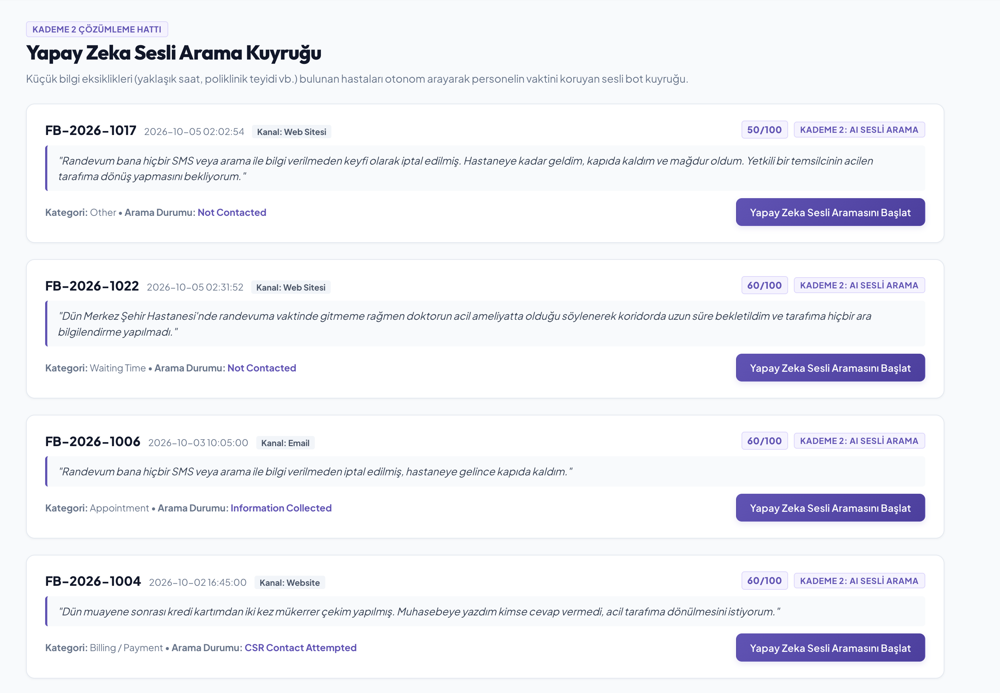
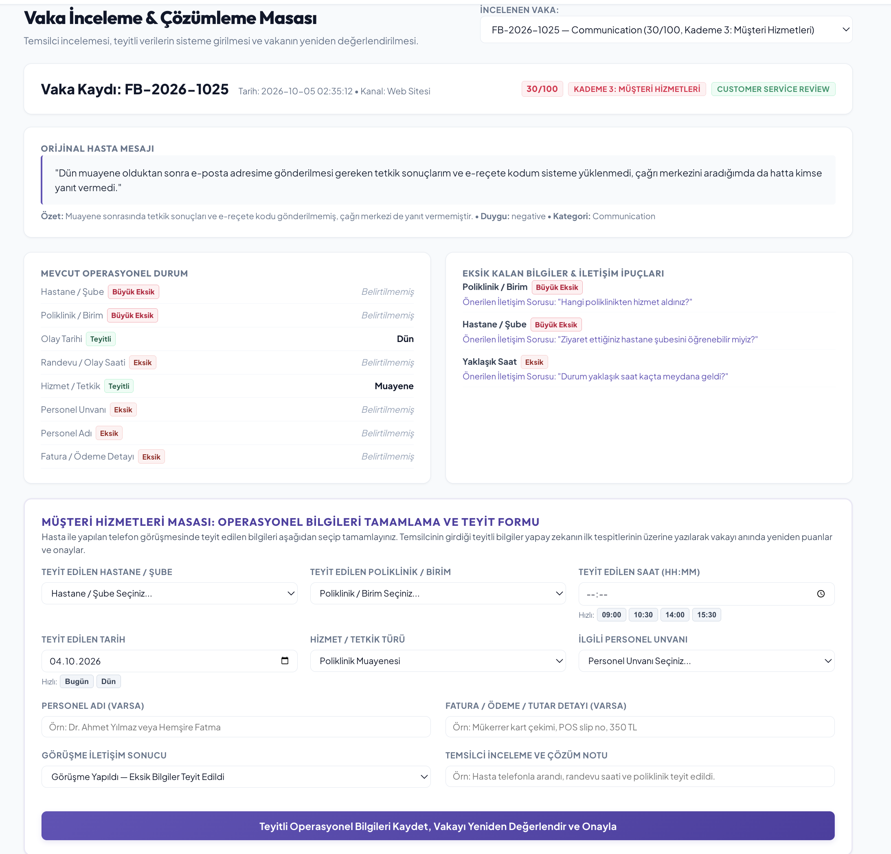
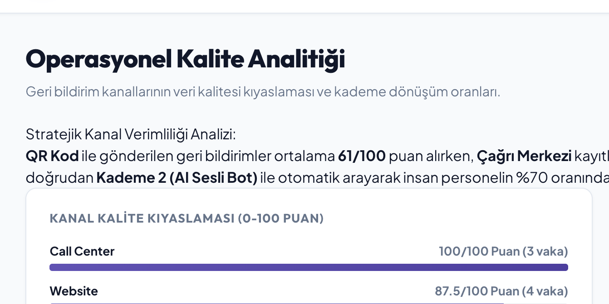
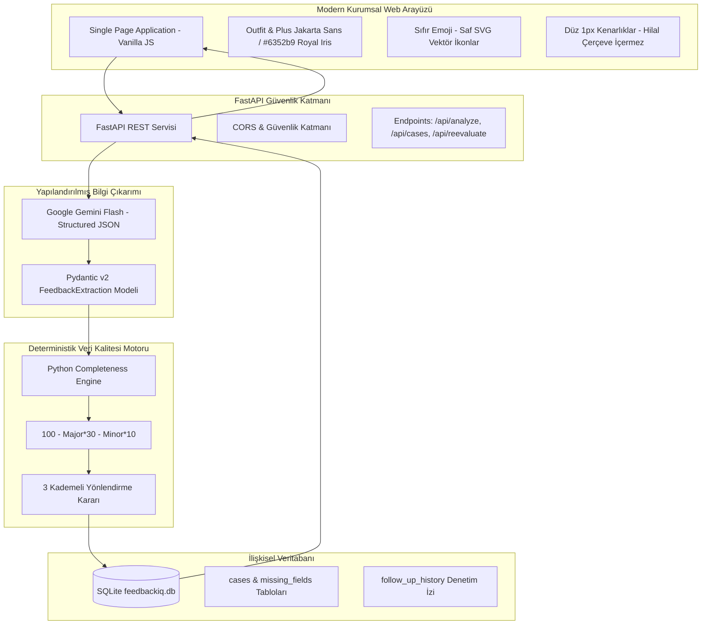

# FeedbackIQ — Müşteri Geri Bildirimlerinde Veri Kalitesi Kontrolü & Operasyonel Veri Açığını Önleme Güvenlik Katmanı

[](https://python.org)
[](https://fastapi.tiangolo.com)
[](https://ai.google.dev/)
[](https://pydantic.dev)
[](feedbackiq/tests/)
[]()
[](LICENSE)

**FeedbackIQ**, sağlık ve kurumsal hizmet sektörlerinde müşteri/hasta geri bildirimlerinin **operasyonel veri kalitesini denetleyen**, **veri açıklarını (Data Deficit) önceden engelleyen** ve eksik bildirimlerin departmanlar arasında kaybolmasını önleyen kurumsal bir **Veri Kalitesi Güvenlik Katmanıdır (Data Quality Firewall)**.

---

## 1. Projenin Odaklandığı Temel Problem: "Operasyonel Veri Açığı"

### Çözülemeyen Geri Bildirimlerin Kaynağı
Büyük ölçekli kurumlarda hastalar veya müşteriler web sitesi, QR formlar, çağrı merkezleri veya e-posta yoluyla her gün yüzlerce geri bildirim bırakır. Ancak bu bildirimlerin %70'inden fazlası operasyonel açıdan **araştırılamaz düzeyde eksiktir**:

> *"Dün hastanenize geldim, bekleme odasında saatlerce bekletildim ve kimse ilgilenmedi. Çok mağdur oldum."*

Bu mesaj samimi bir hasta şikayetidir; ancak doğrudan ilgili operasyonel birime gönderildiğinde **operasyonel kör düğüm** oluşur:
- **Hangi şube / yerleşke?** (Belirsiz — kurumun 15 hastanesi varsa nereye yönlendirilecek?)
- **Hangi poliklinik veya servis?** (Kardiyoloji mi, Göz mü, Acil mi?)
- **Olay günün hangi saatinde yaşandı?** (Vardiya, randevu kuyruğu ve kamera logları taranamaz.)
- **Hangi personel veya hekimle muhatap olundu?** (İlgili birim personeline ulaşılamaz.)

### Operasyonel Maliyet ve Sonuçlar
1. **Bürokrasi ve Departmanlar Arası Paslaşma:** Şube ve birim bilgisi olmayan biletler birim yöneticileri arasında günlerce gezer.
2. **Kapanmayan Açık Vakalar:** Yetersiz veri yüzünden hasta hakları birimi hastaya *"Konu inceleniyor"* dışında somut aksiyon veremez.
3. **Müşteri Kaybı ve Güvensizlik:** Mağdur olan müşteri geri bildiriminin dinlenmediğini hisseder.

---

## 2. FeedbackIQ Çözüm Yaklaşımı: Veri Kalitesi Güvenlik Duvarı

FeedbackIQ, ham geri bildirimleri doğrudan operasyon yöneticilerinin kuyruğuna atmak yerine araya **sessiz, hibrit ve deterministik bir veri kalitesi katmanı** konumlandırır:

```
[Ham Hasta Geri Bildirimi] (Web, QR Kod, Çağrı Merkezi)
             │
             ▼
[1. Adım: Sessiz Yapılandırılmış Çıkarım (Google Gemini Flash)]
Metindeki operasyonel değişkenler (Şube, Birim, Tarih, Saat, Personel, Olay) şemaya ayrıştırılır.
             │
             ▼
[2. Adım: Deterministik Veri Kalitesi Puanlama Motoru (0-100 Skor)]
Kural motoru eksikleri tartar: Büyük Eksik (-30), Küçük Eksik (-10)
             │
             ├────────────────────────────────────────┬────────────────────────────────────────┐
             ▼                                        ▼                                        ▼
      【Aşama 1: Onaylandı】                    【Kademe 2: AI Sesli Arama】             【Kademe 3: Müşteri Hizmetleri】
      (Skor >= 90 / Tam Veri)                  (Skor 50-89 / Küçük Eksik)               (Skor < 50 veya 2+ Büyük Eksik)
             │                                        │                                        │
             ▼                                        ▼                                        ▼
   [Doğrudan Birime Sevk]                    [Otonom AI Sesli Arama]                  [İnsan Temsilci Masası]
Operasyonel inceleme derhal başlar.       Hastayı arar, eksik saati/birimi        Kritik veri eksikliği telefonla
Eksik varsa opsiyonel AI araması yapılır.   otonom teyit edip puanı yükseltir.     tamamlanarak onaylanır.
```

### Temel Prensipler
1. **Sıfır Halüsinasyon Riski:** Yapay zeka iş kararı vermez veya puan hesaplamaz. LLM sadece metinden değişken ayrıştırma ve sesli arama diyaloğunda kullanılır. Yönlendirme ve puanlama %100 deterministik Python kurallarıyla icra edilir.
2. **Kullanıcıyı Bıkkınlığa İtmeyen Tasarım:** Hastanın karşısına can sıkıcı, robotik chatbotlar çıkarılmaz. Hasta şikayetini serbest metinle iletir; arka plan sistemleri veri açığını sessizce tespit eder.
3. **Kapalı Döngü Veri Tamamlama (Closed-Loop Re-evaluation):** Eksik parametreler AI sesli arama veya müşteri temsilcisi tarafından teyit edildiği anda vaka skoru anında 90-100 seviyesine fırlar ve resmi onay alır.

---

## 3. Ekran Görüntüleri & Arayüz Önizlemesi

FeedbackIQ kurumsal arayüzü; **Outfit** ve **Plus Jakarta Sans** modern tipografisi, **#6352b9** kraliyet iris moru kurumsal renk paleti ve yapay zeka sitelerindeki abartılı hilal/ay çerçevelerinden arındırılmış temiz 1px standart kenarlıkları ile donatılmıştır.

---

### Ekran 1: Hasta Deneyimi Kalite Özeti & KPI Dashboard
Kurum genelindeki toplam vaka sayısı, ortalama kalite puanı, 3 kademeli yönlendirme dağılımı ve en çok eksik kalan parametrelerin gerçek zamanlı izlendiği ana çalışma ekranı.


> *Görsel Konumu: `görseller/01_dashboard_kpis.png`*  
> *Bu alanda KPI kartları (Toplam Kayıt, Aşama 1: Onaylandı, Kademe 2: AI Sesli Arama, Kademe 3: Müşteri Hizmetleri, Ortalama Kalite Puanı), kademe dağılım çubukları ve eksik alan grafikleri yer almaktadır.*

---

### Ekran 2: Geri Bildirim Alımı & Deterministik Analiz Masası
Gelen serbest metinli geri bildirimin analiz edildiği, Gemini tarafından çıkarılan operasyonel parametrelerin, 90+ kalite skorunun ve onay durumunun incelendiği alan.


> *Görsel Konumu: `görseller/02_feedback_intake_analysis.png`*  
> *Bu alanda serbest metin giriş formu, Gemini tarafından çıkarılan operasyonel değişkenler, 90 puan onay durumu ve kalan küçük eksiklik için AI sesli arama butonu görüntülenir.*

---

### Ekran 3: Kademe 2 Çözümleme Hattı — Yapay Zeka Sesli Arama Kuyruğu
Küçük operasyonel eksiklikleri (ör. muayene saati veya birim teyidi) bulunan hastaları otonom arayarak personelin vaktini koruyan sesli bot kuyruğu ve arama başlatma paneli.


> *Görsel Konumu: `görseller/03_ai_voice_call_modal.png`*  
> *Bu alanda Kademe 2'ye yönlendirilen vakalar, kalite puanları (50-60/100) ve tek tıkla otonom telefon aramasını başlatan aksiyon butonları sergilenmektedir.*

---

### Ekran 4: Vaka Masası & Canlı Puan Yeniden Hesaplama
Müşteri hizmetleri temsilcisinin telefon görüşmesi sonrasında teyit edilen şube, poliklinik ve saat bilgilerini girdiği; kaydeder kaydetmez skoru 90+ seviyesine çıkararak vakayı anında onayladığı masa.


> *Görsel Konumu: `görseller/04_case_desk_reevaluation.png`*  
> *Bu alanda vaka detay kartı, teyitli parametreler, Büyük Eksik / Eksik etiketleri ve temsilci bilgi tamamlama formu yer almaktadır.*

---

### Ekran 5: Kanal Bazlı Veri Kalitesi & Operasyonel Analitik
Geri bildirimlerin geldiği kanallara (Web Sitesi, QR Kod Masası, Çağrı Merkezi, Mobil Uygulama) göre veri kalitesi ve eksiklik oranlarının karşılaştırmalı analizi.


> *Görsel Konumu: `görseller/05_operational_analytics.png`*  
> *Bu alanda kanal kalite puanları, toplam vaka sayıları ve operasyonel dağılım çubukları sergilenmektedir.*

---

## 4. Deterministik Veri Kalitesi Puanlama Modeli

FeedbackIQ puanlama motoru, sezgisel veya rastgele değerlendirmeler yerine matematiksel ve deterministik bir ceza puanı formülü kullanır:

$$\text{Kalite Skoru} = 100 - (\text{Büyük Eksik Sayısı} \times 30) - (\text{Küçük Eksik Sayısı} \times 10)$$

### Eksiklik Türleri ve Ceza Ağırlıkları

| Eksiklik Türü | Etiket | Ceza Puanı | Örnek Parametreler | Gerekçe |
| :--- | :--- | :--- | :--- | :--- |
| **Büyük Eksik** | `Büyük Eksik` | **-30 Puan** | Hastane Şubesi (`hospital`), Poliklinik / Departman (`department`), Fatura Detayı (`billing_context`) | Lokasyon veya sorumlu birim olmadan şikayetin nereye sevk edileceği bilinemez. İnceleme başlatılamaz. |
| **Küçük Eksik** | `Eksik` | **-10 Puan** | Olay Saati (`approximate_time`), Olay Tarihi (`incident_date`), Personel Unvanı (`staff_role`) | Şube ve birim bellidir; kamera veya randevu logu için tahmini saat eksiktir. AI bot ile kolayca tamamlanabilir. |

### 3 Kademeli Yönlendirme Eşikleri

```
100 Puan ───┬─── [Aşama 1: Onaylandı / Yeterli Veri]
            │    * Skor >= 90
            │    * Vaka doğrudan ilgili poliklinik yöneticisine iletilir.
            │    * Küçük bir eksik varsa opsiyonel "Yapay Zeka Sesli Arama" butonu sunulur.
 90 Puan ───┼────────────────────────────────────────────────────────────────
            │    [Kademe 2: AI Sesli Arama Kuyruğu]
            │    * 50 <= Skor < 90
            │    * Şube bellidir, 1-2 küçük eksik vardır.
            │    * Otonom AI sesli arama botu hastayı arayarak eksik saati tamamlar.
 50 Puan ───┼────────────────────────────────────────────────────────────────
            │    [Kademe 3: Müşteri Hizmetleri İnsan Temsilci Masası]
            │    * Skor < 50 VEYA 2+ Büyük Eksik (ör. şube ve poliklinik yok)
            │    * Yanlış birime gitmesini engellemek için doğrudan temsilciye aktarılır.
  0 Puan ───┴───
```

---

## 5. Sistem Mimarisi & Teknoloji Yığını



### Teknoloji Bileşenleri
- **Programlama Dili:** Python 3.9+
- **API Çatısı:** FastAPI + Uvicorn (Yüksek eşzamanlılık ve asenkron işleme)
- **Veri Doğrulama:** Pydantic v2 (Tip güvenliği ve şema garantisi)
- **Yapay Zeka Katmanı:** Google GenAI SDK (`gemini-2.5-flash` / `gemini-1.5-flash` - Ücretsiz kota uyumlu)
- **Veritabanı:** SQLite (Kurulumsuz, hafif ve ACID garantili ilişkisel kayıt)
- **Frontend Mimarisi:** Vanilla JavaScript (Modern ES6+ SPA) + Modern CSS (Custom Properties, Flexbox/Grid)
- **Tipografi:** Google Fonts Outfit & Plus Jakarta Sans
- **Renk Paleti:** `#6352b9` (Royal Iris Purple), `#4f3ea3` (Koyu Iris), `#059669` (Başarı Yeşili), `#e11d48` (Eskalasyon Kırmızısı)

---

## 6. Proje Dizin Yapısı

```
FeedbackIQ/
├── feedbackiq/
│   ├── config/
│   │   ├── completeness_rules.py    # Kategori bazlı ceza ağırlıkları ve 90/50 eşikleri
│   │   └── hospital_data.py         # Hastane şubeleri ve poliklinik katalogları
│   ├── database/
│   │   ├── db.py                    # SQLite bağlantı yöneticisi ve şema tanımları
│   │   ├── repository.py            # Veritabanı CRUD ve analitik sorguları
│   │   └── seed.py                  # 38 gerçekçi kurumsal geri bildirim tohum verisi
│   ├── models/
│   │   └── feedback_schemas.py      # Pydantic v2 operasyonel veri modelleri
│   ├── services/
│   │   ├── ai_call_service.py       # Otonom sesli arama diyaloğu ve transkript simülatörü
│   │   ├── completeness_service.py  # Deterministik kalite puanlama ve triage motoru
│   │   ├── followup_service.py      # Teyitli veri girişi ve skoru 90+ yapma servisi
│   │   ├── gemini_service.py        # Gemini Flash sessiz yapılandırılmış çıkarım
│   │   └── question_service.py      # Eksik alanlara özel hedeflenmiş soru üretici
│   ├── tests/
│   │   ├── test_completeness.py     # 90 eşiği, ceza puanları ve triage birim testleri
│   │   └── test_feedback_extraction.py # Uçtan uca bilgi çıkarımı ve sesli arama testleri
│   ├── web/
│   │   ├── app.js                   # SPA kontrolcüsü, canlı analiz ve dinamik formlar
│   │   ├── index.html               # 7 çalışma masalı modern HTML arayüzü
│   │   └── styles.css               # Outfit/Plus Jakarta Sans ve #6352b9 tasarım sistemi
│   └── server.py                    # FastAPI uygulama sunucusu ve REST rotaları
├── görseller/                       # Ekran görüntüleri dizini
├── .env.example                     # Örnek çevre değişkenleri konfigürasyonu
├── LICENSE                          # MIT Açık Kaynak Lisansı
├── README.md                        # Detaylı proje dokümantasyonu
└── requirements.txt                 # Python bağımlılıkları listesi
```

---

## 7. Kurulum & Yerel Çalıştırma

### Ön Gereksinimler
- Python 3.9 veya daha yeni bir sürüm
- Git
- Ücretsiz Google AI Studio API Anahtarı ([aistudio.google.com](https://aistudio.google.com/) adresinden ücretsiz alınabilir, kredi kartı gerekmez)

### Adım 1: Projeyi Klonlayın
```bash
git clone https://github.com/efehakanyildiz/FeedbackIQ.git
cd FeedbackIQ
```

### Adım 2: Sanal Ortam Oluşturun ve Bağımlılıkları Yükleyin
```bash
python3 -m venv venv
source venv/bin/activate
pip install -r requirements.txt
```

### Adım 3: Çevre Değişkenlerini Tanımlayın
`.env.example` dosyasını `.env` olarak kopyalayın ve Gemini API anahtarınızı girin:
```bash
cp .env.example .env
```
`.env` dosyasını düzenleyin:
```env
GEMINI_API_KEY=AIzaSy...sizinkeyiniz...
GEMINI_MODEL=gemini-2.5-flash
DEMO_MODE=false
```

### Adım 4: Uygulama Sunucusunu Başlatın
```bash
uvicorn feedbackiq.server:app --host 127.0.0.1 --port 8000 --reload
```
Başlatma sonrasında tarayıcınızdan **[http://127.0.0.1:8000](http://127.0.0.1:8000)** adresine gidin. Veritabanı ve 38 örnek vaka tohum verisi otomatik olarak hazırlanacaktır.

---

## 8. Otomasyon Test Paketi

Proje iş kuralları ve puanlama formülleri kapsamlı testlerle korunmaktadır:
```bash
PYTHONPATH=. pytest feedbackiq/tests/ -v
```

### Doğrulanan 11 Test Senaryosu:
1. `test_sufficient_data_reaches_tier_1_approved`: Tam verili vakaların doğrudan 90+ puan alıp onaylanması.
2. `test_minor_gap_reaches_tier_2_ai_call`: Tek bir küçük eksiklikle (saat eksik) 90 puana ulaşıp AI butonu sunulması veya 80 puanda Kademe 2'ye yönlendirilmesi.
3. `test_major_gap_reaches_tier_3_csr_escalation`: Şube ve poliklinik eksik olduğunda skorun 40'a düşüp Kademe 3 Müşteri Hizmetlerine eskalasyonu.
4. `test_appreciation_has_lighter_requirements`: Teşekkür mesajlarının hafifletilmiş kurallarla 90+ puan alması.
5. `test_adding_followup_information_increases_score_and_resolves`: Temsilci teyidi sonrası puanın 90-100 seviyesine yükselip vakanın çözülmesi.
6. `test_manually_confirmed_values_take_precedence`: Temsilcinin girdiği değerlerin model çıkarımının üzerine yazılması.
7. `test_question_generator_asks_only_about_missing_fields`: Soru motorunun yalnızca eksik kalan alanlar için soru üretmesi.
8. `test_no_duplicate_missing_fields`: Eksik alan listesinde mükerrer kayıt oluşmaması.
9. `test_threshold_rules_consistency`: 90 onay ve 50 inceleme eşiklerinin doğrulanması.
10. `test_core_end_to_end_scenario`: Serbest metin alımından SQLite kaydına kadar uçtan uca akış testi.
11. `test_ai_voice_call_simulation`: Otonom sesli arama simülatörünün eksik veriyi tamamlayıp onay vermesi.

---

## 9. Lisans

Bu proje **MIT Lisansı** altında lisanslanmıştır. Detaylar için [LICENSE](LICENSE) dosyasına göz atabilirsiniz.
